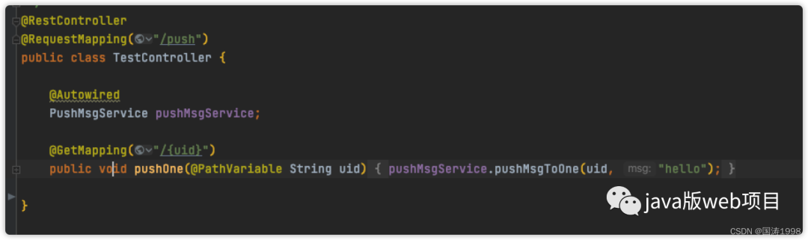
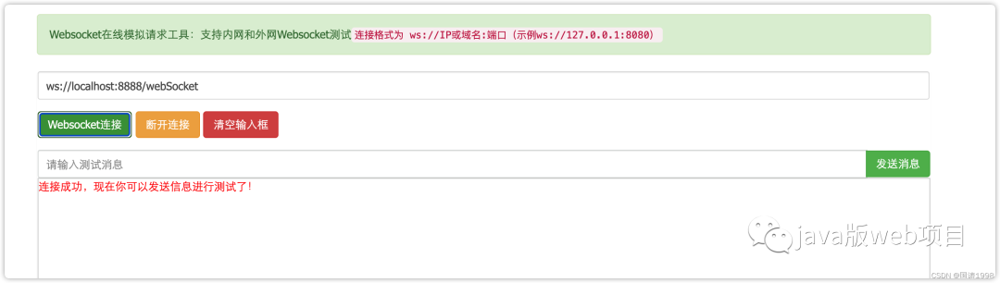
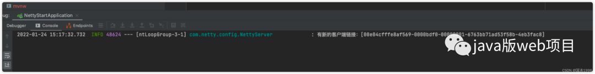
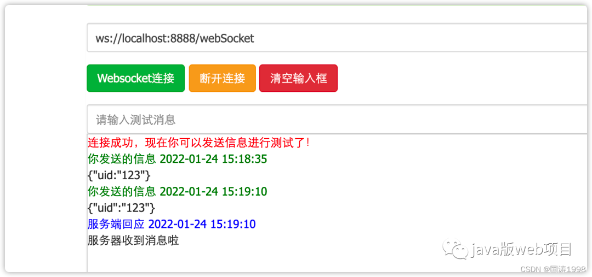
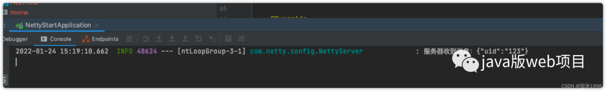
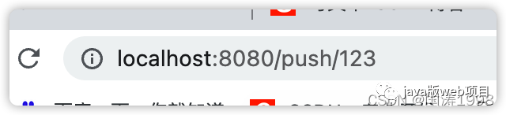
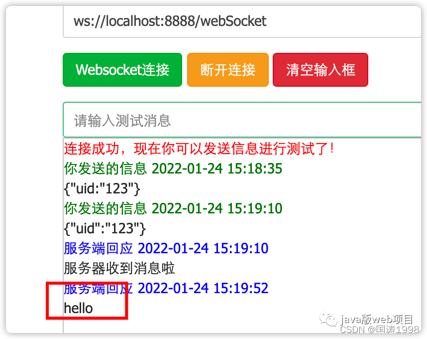

Netty + websocket 的消息推送小栗子
1.1 netty服务器
@Component
public class NettyServer {

    static final Logger log = LoggerFactory.getLogger(NettyServer.class);

    /**
     * 端口号
     */
    @Value("${webSocket.netty.port:8888}")
    int port;

    EventLoopGroup bossGroup;
    EventLoopGroup workGroup;

    @Autowired
    ProjectInitializer nettyInitializer;

    @PostConstruct
    public void start() throws InterruptedException {
        new Thread(() -> {
            bossGroup = new NioEventLoopGroup();
            workGroup = new NioEventLoopGroup();
            ServerBootstrap bootstrap = new ServerBootstrap();
            // bossGroup辅助客户端的tcp连接请求, workGroup负责与客户端之前的读写操作
            bootstrap.group(bossGroup, workGroup);
            // 设置NIO类型的channel
            bootstrap.channel(NioServerSocketChannel.class);
            // 设置监听端口
            bootstrap.localAddress(new InetSocketAddress(port));
            // 设置管道
            bootstrap.childHandler(nettyInitializer);

            // 配置完成，开始绑定server，通过调用sync同步方法阻塞直到绑定成功
            ChannelFuture channelFuture = null;
            try {
                channelFuture = bootstrap.bind().sync();
                log.info("Server started and listen on:{}", channelFuture.channel().localAddress());
                // 对关闭通道进行监听
                channelFuture.channel().closeFuture().sync();
            } catch (InterruptedException e) {
                e.printStackTrace();
            }
        }).start();
    }

    /**
     * 释放资源
     */
    @PreDestroy
    public void destroy() throws InterruptedException {
        if (bossGroup != null) {
            bossGroup.shutdownGracefully().sync();
        }
        if (workGroup != null) {
            workGroup.shutdownGracefully().sync();
        }
    }
}

2.2 Netty配置
public class NettyConfig {

    /**
     * 定义全局单利channel组 管理所有channel
     */
    private static volatile ChannelGroup channelGroup = null;

    /**
     * 存放请求ID与channel的对应关系
     */
    private static volatile ConcurrentHashMap<String, Channel> channelMap = null;

    /**
     * 定义两把锁
     */
    private static final Object lock1 = new Object();
    private static final Object lock2 = new Object();

    public static ChannelGroup getChannelGroup() {
        if (null == channelGroup) {
            synchronized (lock1) {
                if (null == channelGroup) {
                    channelGroup = new DefaultChannelGroup(GlobalEventExecutor.INSTANCE);
                }
            }
        }
        return channelGroup;
    }

    public static ConcurrentHashMap<String, Channel> getChannelMap() {
        if (null == channelMap) {
            synchronized (lock2) {
                if (null == channelMap) {
                    channelMap = new ConcurrentHashMap<>();
                }
            }
        }
        return channelMap;
    }

    public static Channel getChannel(String userId) {
        if (null == channelMap) {
            return getChannelMap().get(userId);
        }
        return channelMap.get(userId);
    }
}

2.3 管道配置
@Component
public class ProjectInitializer extends ChannelInitializer<SocketChannel> {

    /**
     * webSocket协议名
     */
    static final String WEBSOCKET_PROTOCOL = "WebSocket";

    /**
     * webSocket路径
     */
    @Value("${webSocket.netty.path:/webSocket}")
    String webSocketPath;
    @Autowired
    WebSocketHandler webSocketHandler;

    @Override
    protected void initChannel(SocketChannel socketChannel) throws Exception {
        // 设置管道
        ChannelPipeline pipeline = socketChannel.pipeline();
        // 流水线管理通道中的处理程序（Handler），用来处理业务
        // webSocket协议本身是基于http协议的，所以这边也要使用http编解码器
        pipeline.addLast(new HttpServerCodec());
        pipeline.addLast(new ObjectEncoder());
        // 以块的方式来写的处理器
        pipeline.addLast(new ChunkedWriteHandler());
        pipeline.addLast(new HttpObjectAggregator(8192));
        pipeline.addLast(new WebSocketServerProtocolHandler(webSocketPath, WEBSOCKET_PROTOCOL, true, 65536 * 10));
        // 自定义的handler，处理业务逻辑
        pipeline.addLast(webSocketHandler);
    }
}

2.4 自定义handler
@Component
@ChannelHandler.Sharable
public class WebSocketHandler extends SimpleChannelInboundHandler<TextWebSocketFrame> {
private static final Logger log = LoggerFactory.getLogger(NettyServer.class);

    /**
     * 一旦连接，第一个被执行
     */
    @Override
    public void handlerAdded(ChannelHandlerContext ctx) throws Exception {
        log.info("有新的客户端链接：[{}]", ctx.channel().id().asLongText());
        // 添加到channelGroup 通道组
        NettyConfig.getChannelGroup().add(ctx.channel());
    }

    /**
     * 读取数据
     */
    @Override
    protected void channelRead0(ChannelHandlerContext ctx, TextWebSocketFrame msg) throws Exception {
        log.info("服务器收到消息：{}", msg.text());

        // 获取用户ID,关联channel
        JSONObject jsonObject = JSONUtil.parseObj(msg.text());
        String uid = jsonObject.getStr("uid");
        NettyConfig.getChannelMap().put(uid, ctx.channel());

        // 将用户ID作为自定义属性加入到channel中，方便随时channel中获取用户ID
        AttributeKey<String> key = AttributeKey.valueOf("userId");
        ctx.channel().attr(key).setIfAbsent(uid);

        // 回复消息
        ctx.channel().writeAndFlush(new TextWebSocketFrame("服务器收到消息啦"));
    }

    @Override
    public void handlerRemoved(ChannelHandlerContext ctx) throws Exception {
        log.info("用户下线了:{}", ctx.channel().id().asLongText());
        // 删除通道
        NettyConfig.getChannelGroup().remove(ctx.channel());
        removeUserId(ctx);
    }

    @Override
    public void exceptionCaught(ChannelHandlerContext ctx, Throwable cause) throws Exception {
        log.info("异常：{}", cause.getMessage());
        // 删除通道
        NettyConfig.getChannelGroup().remove(ctx.channel());
        removeUserId(ctx);
        ctx.close();
    }

    /**
     * 删除用户与channel的对应关系
     */
    private void removeUserId(ChannelHandlerContext ctx) {
        AttributeKey<String> key = AttributeKey.valueOf("userId");
        String userId = ctx.channel().attr(key).get();
        NettyConfig.getChannelMap().remove(userId);
    }
}

2.5 推送消息接口及实现类
public interface PushMsgService {

    /**
     * 推送给指定用户
     */
    void pushMsgToOne(String userId, String msg);

    /**
     * 推送给所有用户
     */
    void pushMsgToAll(String msg);

}
@Service
public class PushMsgServiceImpl implements PushMsgService {

    @Override
    public void pushMsgToOne(String userId, String msg) {
        Channel channel = NettyConfig.getChannel(userId);
        if (Objects.isNull(channel)) {
            throw new RuntimeException("未连接socket服务器");
        }

        channel.writeAndFlush(new TextWebSocketFrame(msg));
    }

    @Override
    public void pushMsgToAll(String msg) {
        NettyConfig.getChannelGroup().writeAndFlush(new TextWebSocketFrame(msg));
    }
}

2.6 测试

2.7
链接服务器

发送消息

调用接口，往前端推送消息！

