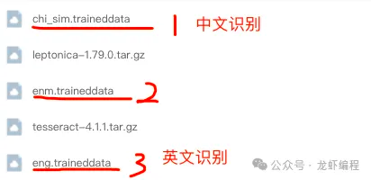

OCR识别：
Tesseract是一个开源的光学字符识别（OCR）引擎，Tess4J是一个基于Tesseract OCR引擎的Java接口。

1、Tesseract-OCR环境搭建
1.1 基础依赖安装
#1、基础依赖
yum -y install gcc-c++ make
yum install -y autoconf automake libtool libjpeg libpng libtiff zlib libjpeg-devel libpng-devel libtiff-devel zlib-devel
#2、下载pkg-config
wget https://pkg-config.freedesktop.org/releases/pkg-config-0.29.tar.gz
#解压
tar -zxvf pkg-config-0.29.tar.gz
#编译
cd pkg-config-0.29/
 ./configure --with-internal-glib
make
make check
make install

1.2 安装leptonica（下载leptonica-1.79.0.tar.gz）
#1、解压文件
tar -zxvf leptonica-1.79.0.tar.gz
#2、编译
./autogen.sh
./configure --prefix=/usr/local/
make
make install
配置leptonica： vi /etc/profile
-----------------添加配置------------------------
export LD_LIBRARY_PATH=$LD_LIBRARY_PAYT:/usr/local/lib
export LIBLEPT_HEADERSDIR=/usr/local/include
export PKG_CONFIG_PATH=/usr/local/lib/pkgconfig
#刷新生效
source /etc/profile

1.3 安装tesseract（下载tesseract-4.1.1.tar.gz）
#1、解压文件
tar -zxvf tesseract-1.1.tar.gz
#2、编译
./autogen.sh
./configure --with-extra-includes=/usr/local/include --with-extra-libraries=/usr/local/include
make
make install
测试安装是否成功：tesseract --version
将下列文件放在/usr/local/share/tessdata文件夹下

2、Springboot搭建Tesseract-OCR平台服务
2.1 pom.xml
<!-- tess4j -->
<dependency>
    <groupId>net.sourceforge.tess4j</groupId>
    <artifactId>tess4j</artifactId>
    <version>4.5.4</version>
</dependency>

2.2 配置文件
#指定识别语言库的位置
tess4j:
  datapath: /usr/local/share/tessdata

2.3 config
@Configuration
public class TesseractOcrConfig {
    @Value("${tess4j.datapath}")
    private String dataPath;

    @Bean
    public Tesseract tesseract() {

        Tesseract tesseract = new Tesseract();
        //设置数据文件夹路径
        tesseract.setDatapath(dataPath);
        //设置为中文简体
        tesseract.setLanguage("chi_sim");
        return tesseract;
    }

}

2.4  controller、service
@RestController
@RequestMapping("/api")
@Slf4j
@Api(description = "OCR服务")
public class OcrController {

    @Resource
    private OcrService ocrService;

    @PostMapping(value = "/recognize")
    public String recognizeImage(@RequestParam("file") MultipartFile file) throws TesseractException, IOException {
        // 调用OcrService中的方法进行文字识别
        String result = ocrService.recognizeText(file);
        log.info("识别图片的结果:{}", result);

        return result;
    }
}

@Service
@Slf4j
public class OcrService {

    @Resource
    private Tesseract tesseract;

    /**
     *
     * @param imageFile 要识别的图片
     * @return
     */
    public String recognizeText(MultipartFile imageFile) throws IOException, TesseractException {
        // 转换
        InputStream sbs = new ByteArrayInputStream(imageFile.getBytes());
        BufferedImage bufferedImage = ImageIO.read(sbs);

        // 对图片进行文字识别
        return tesseract.doOCR(bufferedImage);
    }
}
